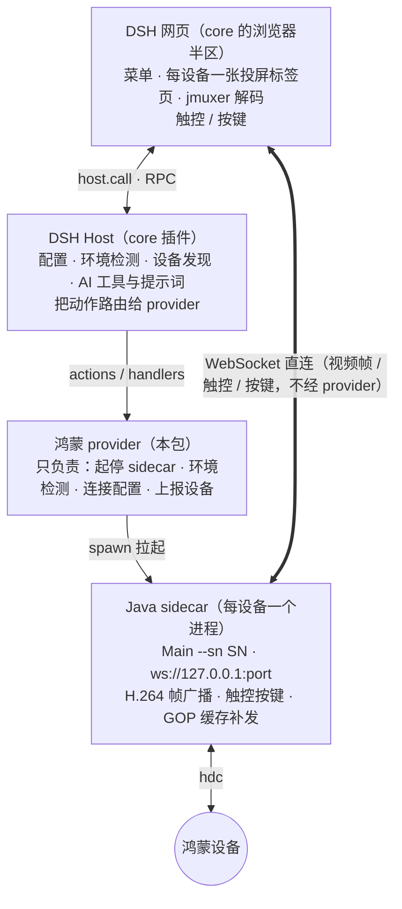

# 开发资料（本目录）

> **基于 core 开发 provider** → [core/Dev/doc.md](https://github.com/ns-zzj/dsh-scrcpy-core/blob/main/Dev/doc.md)
> （契约、core 会调你的动作、你要上报什么、文案与语言规则、画面四件套、坐标与画面尺寸的坑 —— 想给别的平台接一个 provider 就看那份。）

## 架构

**关键点**：浏览器半区**直连 sidecar** 收发视频与触控，provider **不在流路径里** —— 它只负责把 sidecar 拉起来、报设备、报配置。

## 开发约定

- **sidecar 逻辑**改 `Dev/src/Main.java`；编译产物要同步到 `resources/out/`，**必须用 `--release 8`**（原版 class 目标是 Java 8，用新 JDK 默认编出 69/61 会让老 Java 起不来）；命令见 `doc-sidecar.md`。
- **协议改动**要三处同步：`Dev/src/Main.java`（收发）、`Dev/demo/` 里的探针/测试页（验证）、以及 core 浏览器半区里对应那段（消费）。
- **改了 Java 必须重启用到它的进程**（demo 与插件都是启动时加载）。
- 改完 sidecar 要在 demo 里先独立验一遍，再在 DSH 里验，最后才重新打包。

## Dev/demo/ —— 独立测试件（不依赖 DSH，也不进 npm 包）

| 文件 | 干什么 | 怎么跑 |
|---|---|---|
| `browser-demo.mjs` | 起 sidecar + 递一个网页（jmuxer + `<video>`），带「暂停 / 恢复」按钮 —— 用来验证"**暂停中转屏 → 恢复时补发 GOP**"和"**转屏时先换 jmuxer 再喂**" | `node hos/Dev/demo/browser-demo.mjs` → 浏览器打开它打印的 `http://127.0.0.1:8899/` |
| `probe-stream.mjs` | 命令行探针：起 sidecar、连它的 WS、解 SPS 拿**真实编码尺寸**、按时间线打 SPS/PPS/IDR | `node hos/Dev/demo/probe-stream.mjs [秒数]` |
| `probe-pause-rotate.mjs` | 复现"暂停 → 转屏 → 恢复"：每 2 秒问一次尺寸，**检测到方向变了自动恢复**，恢复后再看 20 秒有没有新 SPS | `node hos/Dev/demo/probe-pause-rotate.mjs [scale]` |
| `index-2x.html` | 2.x 时代的独立测试页（历史遗留，还能打开看协议） | 浏览器直接打开 |
| `jmuxer.min.js` | 上面那些 demo 页用的 jmuxer（与插件同源） | — |

跑之前设好环境变量：**`HOS_SN`**（必填，`hdc list targets` 里的设备号），可选 `HOS_HDC` / `HOS_JAVA`（不设就用 PATH 里的 `hdc` / `java`，需要 Java 8+）。设备要连着。

## 另外两个文件

- **`doc-sidecar.md`** —— sidecar（`Dev/src/Main.java`）的协议、编译（必须 `--release 8`）、踩坑记录；**改 Java 前先看它**。
- **`Dev/src/Main.java`** —— sidecar 源码（DSH ⇄ 设备的 Java 桥）。编译产物在 `resources/out/`，**随包发布**。
