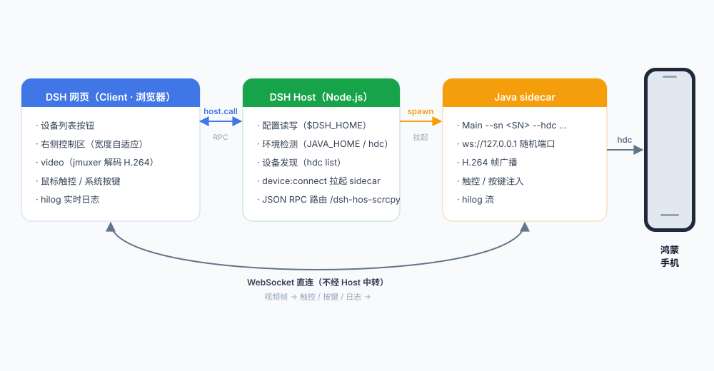

# dsh-hos-scrcpy — DSH 鸿蒙投屏控制插件

开发手机软件的时候总是手机电脑来回操作，所以搞了个这玩意，在 Deepseek Harness 网页里就能控制。

在 DSH 网页内直接投屏并操作鸿蒙（HarmonyOS NEXT）手机：实时画面、鼠标触控、系统按键、hilog 日志，无需在两个屏幕之间切换。

## 功能

- **设备发现**：USB / 局域网无线调试（hdc 已连接设备自动列出）
- **实时投屏**：H.264 视频流，网页播放（jmuxer.js）
- **触控操作**：鼠标点击 / 拖动 = 手机触摸（坐标自动换算设备分辨率）
- **系统按键**：返回 / 主页 / 音量+ / 音量- 按钮
- **hilog 日志**：设备实时日志滚动查看（每秒限速 60 行，保留最近 500 行）
- **自适应布局**：右侧控制区宽度按手机屏幕比例自动调整，聊天区自动让位
- **环境自动检测**：`JAVA_HOME` / `DEVECO_SDK_HOME` 环境变量优先，支持手动配置

## 环境要求

| 依赖 | 说明 |
|---|---|
| DSH 运行环境 | 插件以动态 Cordis 插件形式加载 |
| Java 8+ | sidecar 桥接程序运行环境 |
| hdc | DevEco Studio 自带（`<DevEco>/sdk/default/openharmony/toolchains/hdc.exe`） |
| 鸿蒙手机 | 开启开发者模式 + USB 调试（或 `hdc tconn` 无线连接） |

## 目录结构

```
dsh-hos-scrcpy/
├── LICENSE                      # MIT 许可（原项目 HOScrcpy 署名）
├── README.md
├── architecture.svg             # 架构图
├── PluginMain/                  # 插件本体 + sidecar 运行时资源（全部必需）
│   ├── host.js                  # 插件 Host 半区源码（DSH 进程内 Node.js）
│   ├── client.js                # 插件 Client 半区源码（浏览器 React）
│   ├── jmuxer.min.js            # H.264 网页解码库（运行时读取）
│   ├── hosScrcpy-1.0.18-beta.jar  # 华为官方 SDK（运行时必需）
│   └── out/                     # sidecar 编译产物（运行时必需）
└── HOScrcpy-main/               # 官方参考项目（源码、原包 SDK）
```

## 参考项目

本项目基于 [HOScrcpy](https://gitcode.com/OpenHarmonyToolkitsPlaza/HOScrcpy)开发。
原项目采用 [MIT 开源协议](https://gitcode.com/OpenHarmonyToolkitsPlaza/HOScrcpy/blob/main/LICENSE)。

## 使用

### 1. 加载插件（DSH 动态插件）

在 DSH 会话中定义并运行插件（`scry-1`），批准后右上角出现「设备列表」按钮：

1. 设备列表 → 鸿蒙设备 → 点「投屏」
2. 等待部署（首次约 10 秒，需推送手机端组件）
3. 右侧出现控制区：手机画面 + 按键
4. 点「日志▸」查看 hilog 实时日志

### 2. 独立测试（不依赖 DSH）

```bash
# 启动 sidecar（自动发现唯一在线设备）
java -cp "<SDK jar>;<out目录>" Main --hdc "<hdc路径>" --port 18999

# 浏览器打开 demo/index.html 连接测试
```

## 架构



## 安全说明

- sidecar 只监听 `127.0.0.1` 回环地址（随机端口），不暴露局域网
- 无任何外部网络请求（审计确认：全部源码与原生库无外联域名）
- 设备端命令仅限白名单（hilog / uinput / uitest / snapshot_display 等）
- 仅支持本机 hdc 已连接设备（USB / 局域网无线调试），不含远程真机模式

## 已知限制

- 键盘文本输入未内置（系统输入法注入延迟高，已移除），输入请在手机上操作或使用系统输入法配合鼠标点击
- 仅支持鸿蒙设备；安卓暂不支持
- 动态插件定义随 DSH 进程重启失效，需重新定义加载

## 构建 sidecar（如需重新编译）

```bash
javac -encoding UTF-8 -cp "<SDK jar>" -d out src/Main.java
```