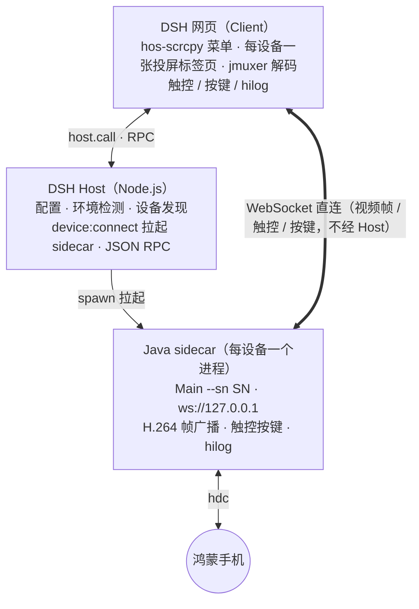

# dsh-hos-scrcpy — DSH 鸿蒙投屏控制插件

[](https://awesome-dsh-plugin.com/p/ns-zzj/dsh-hos-scrcpy/) [](https://www.dsh.so/artifact/dsh-hos-scrcpy/)

> 开发手机软件时总在手机和电脑之间来回切换，太麻烦了。这个插件让你在 DeepSeek Harness 网页里**直接操作鸿蒙手机**：
> 实时投屏、鼠标触控、系统按键、hilog 日志，**AI 助手还能"看到"并"操作"手机屏幕**——截图识别、读控件清单、点击/长按、按返回/Home、输入文本，开发调试不用再两头跑。

## 它能做什么

- **电脑上操作手机**：网页内实时投屏鸿蒙（HarmonyOS NEXT）手机，鼠标点击/拖动即触摸，返回/主页/音量键一键可按，无需在手机和电脑屏幕之间切换
- **多设备同时投屏**：每台设备一张右侧栏标签页（标签上写着设备名），点设备行就在标签页之间跳转；已有该设备的标签页就切过去，没有才新建——同时调两台手机不用来回连接
- **切到别处也不断流**：投屏画面暂停而非停止（画面不可见时停推流、回来时请求一个关键帧立刻续上），切标签页 / 切会话回来画面接着放；sidecar 空闲 5 分钟自动退出，不留后台进程
- **AI 也能识别屏幕**：开启「允许截图」后，AI 可用 `hos_scrcpy_screenshot` 工具截取手机屏幕并识别画面内容（可选"需要确认"或"无需确认"模式），例如"当前页面是什么应用？界面上有哪些按钮？屏幕上显示了什么错误？"
- **AI 也能操作屏幕**：开启「允许控制」后，AI 先用 `hos_scrcpy_locate` 读取当前屏幕的可操作控件清单（type/text/id/key/比例坐标），再用 `hos_scrcpy_tap` 点击、`hos_scrcpy_longpress` 长按，每次执行前二次确认并在投屏画面上闪烁绿点显示落点
- **AI 按键 / 输入**：`hos_scrcpy_key` 按返回/Home 键；`hos_scrcpy_input` 向当前聚焦输入框注入文本（支持中文）；面板也提供手动「输入」按钮
- **截图入聊天框**：一键截取当前屏幕，像粘贴图片一样加进聊天输入框
- **hilog 实时日志**：设备日志滚动查看（限速 60 行/秒，保留最近 500 行），排查问题不用开 DevEco

## 功能特性

| 功能 | 说明 |
|---|---|
| 设备发现 | USB / 局域网无线调试，`hdc` 已连接设备自动列出 |
| 多设备投屏 | 每台设备独立 sidecar + 独立标签页，互不干扰；设备行走 `●`（运行中）/ `○`（未运行），未运行时按钮是「启动」，运行中是「投屏」+「断开」 |
| 实时投屏 | H.264 视频流，网页播放（jmuxer.js） |
| 触控操作 | 鼠标点击/拖动 = 手机触摸，坐标自动换算设备分辨率 |
| 系统按键 | 返回 / 主页 / 音量+ / 音量- |
| hilog 日志 | 设备实时日志滚动查看 |
| AI 截图识别 | `hos_scrcpy_screenshot` 工具（默认识别模型 `deepseek-flash`，可在投屏面板「设置」里换成任意支持图片输入的模型），截图前二次确认（或设为"无需确认"） |
| AI 控件清单 | `hos_scrcpy_locate` 工具（hdc uitest 布局树 → 压缩可操作控件清单，含 type/text/fx/fy/w/h） |
| AI 点击/长按 | `hos_scrcpy_tap` / `hos_scrcpy_longpress` 工具（比例坐标，执行前二次确认 + 落点绿点预览） |
| AI 按键/输入 | `hos_scrcpy_key`（返回/Home 键）· `hos_scrcpy_input`（聚焦输入框注入文本） |
| AI 目标设备 | 多设备下 AI 工具**只作用于当前聚焦（面板可见）的那台**，没有聚焦设备就直接报错、绝不猜设备 |
| 权限分级 | 四项权限独立三态：允许截图 / 允许控制 / 允许按键 / 允许输入（禁止使用 / 需要确认 / 无需确认），控制/按键/输入依赖允许截图 |
| 截图入聊天框 | 截屏并直接加入聊天输入框 |
| 右侧栏标签页 | 投屏画面进 DSH 右侧栏标签页（自动展开），**每台设备一张**；面板常驻在会话头部，不随标签页卸载，所以切走再切回来画面接着放 |
| 切页暂停/恢复 | 画面不可见时向 sidecar 发 `pause`（停推流、省解码与内存），回来发 `resume` 并请求一个 IDR 关键帧（实测约 100ms 出新关键帧），不会黑屏 |
| 无线自动降画质 | 自动判有线(USB)/无线(TCP)：无线时视频流固定缩到 1/4 省流，有线固定 1/2 |
| 帧率可调 | 有线 / 无线帧率可在「设置」里调（默认 60 / 30）。SDK 自身默认是 120fps，对网页软解太重，所以插件主动压下来 |
| 空闲自动退出 | sidecar 5 分钟没有客户端连接就自己退出，设备掉线也会被清理，不留僵尸进程 |
| 环境自动检测 | `JAVA_HOME` / `DEVECO_SDK_HOME` 优先，支持手动配置 |

## 环境要求

| 依赖 | 说明 |
|---|---|
| DSH 运行环境 | 电脑端（Windows / macOS / Linux）的 DeepSeek Harness；插件经包安装后随 web profile 常驻 |
| Java 8+ | sidecar 桥接程序运行环境 |
| hdc | DevEco Studio 自带，位于 DevEco 安装目录下的 `sdk/default/openharmony/toolchains/hdc.exe` |
| 鸿蒙手机 | 开启开发者模式 + USB 调试（或 `hdc tconn` 无线连接） |

## 目录结构

```
dsh-hos-scrcpy/
├── README.md
├── LICENSE
├── package.json                # dsh.bundle / dsh.client 声明（npm pack / dsh plugin add 入口）
├── cordis.patch.yml            # bundle patch：向组合树插入插件行
├── lib/
│   └── index.js                # Host 半区（webServer RPC 路由）
├── client/
│   └── client.js               # Client 半区
├── resources/                  # sidecar 运行时资源（全部必需）
│   ├── hosScrcpy-1.0.18-beta.jar
│   ├── out/                    # Main 及内部类（javac 编译产物）
│   └── jmuxer.min.js
└── Dev/                        # （随仓库提供，不在 npm 包内）sidecar 源码 + 独立测试环境
    ├── src/Main.java           # sidecar 主程序源码（唯一手写源码）
    ├── demo/index.html         # 独立测试页（不依赖 DSH）
    ├── demo/jmuxer.min.js      # H.264 网页解码库
    └── doc.md                  # Dev 目录开发文档（协议/编译/排障）
```

## 快速开始

一条命令装进 web profile（从仓库直接装，不用先下载文件）：

`dsh plugin --profile web add github:ns-zzj/dsh-hos-scrcpy`

重启 `dsh web` 后插件常驻，会话右上角出现「**hos-scrcpy 菜单**」按钮即成功。

> 这一步装不上？改用 Release 里的 tgz：下载后在存放它的目录里执行
> `dsh plugin --profile web add ./dsh-hos-scrcpy-2.1.1.tgz`

1. 「hos-scrcpy 菜单」→ 选中设备 → 点「投屏」→ 等待部署（首次约 10 秒）→ **右侧栏自动展开成该设备的投屏标签页**（标签上写着设备名）：手机画面 + 按键
2. 换第二台设备：菜单里点它那行的「投屏」→ 新建第二张标签页；两台同时在线，点哪行就跳哪张标签页；某台要收工，点它那行的「断开」（只断这台，别的照常放）
3. 投屏面板点「日志▸」查看 hilog 实时日志
4. 投屏面板点「设置」→ 打开「允许截图」/「允许控制」「允许按键」「允许输入」即可让 AI 识别并操作屏幕（每项可选"需要确认"或"无需确认"；控制/按键/输入依赖允许截图）。同一弹层里还能换识别模型、调有线/无线帧率

> 多设备时 AI 工具作用于**当前聚焦的那台**（即面板正在显示画面的那台）；切到哪台的面板，AI 就操作哪台。

## 架构



## 二次开发

**[开发文档](Dev/doc.md)** —— sidecar 源码解析、WebSocket 协议、编译与同步、独立测试页用法、常见故障排查，二次开发从这里开始。

- 改动约定：sidecar 逻辑改 `Dev/src/Main.java`（编译产物同步到插件目录的 `out/`）；
  协议改动要三处同步（`Main.java` + `Dev/demo/index.html` + 插件 `client.js`）；
  前端 UI 只改插件 `client.js`
- 静态包（npm/tgz）的 `client/client.js` 是动态版 `client.js` 的机械改写成品，**改一处必须同步另一处**（原先生成它的脚本 `Dev/gen-static-client.mjs` 已废弃删除）：`host.call(`→`rpc(`、`styles.insert(`→`insertStyles(`、`ctx.timer.interval(`→`interval(`、`ctx.timer.timeout(`→`timeout(`，插件对象改为 `exports.inject = ['slots', 'sidebarRightTabs', 'sidebarRight']` + `exports.apply`，并用 `window.__ModuleLoader__.load({ id, factory })` 包一层；改完务必在静态包里实测一次投屏（`inject` 里漏写 sidebar 服务会让 `apply` 静默退化）

## 安全说明

- sidecar 只监听 `127.0.0.1` 回环地址（随机端口），不暴露局域网
- 无任何外部网络请求（审计确认：全部源码与原生库无外联域名）
- 设备端命令仅限白名单（hilog / uinput / uitest / snapshot_display 等）
- 仅支持本机 hdc 已连接设备（USB / 局域网无线调试），不含远程真机模式

## 兼容性

`package.json` 要求 `@deepseek-ai/dsh-tools >= 0.1.5-0`（0.1.5 以前的 DSH 不支持）。

| DSH 版本 | 结果 |
|---|---|
| 0.1.5-rc.3 | 开发与日常自测环境：插件 2.1.0 的动态版多设备同时投屏、标签页跳转、切页恢复，以及静态 tgz 的安装 / 标签页投屏 / 断开，都在此版本实测 |

> 2.1.0 的自测范围：动态版多设备同时投屏、标签页跳转、切页恢复；静态 tgz 的安装、标签页投屏、断开。**静态 tgz 的多设备同时投屏尚未逐项复测**。

## 已知限制

- **多设备与 AI**：AI 工具只认"当前聚焦（面板可见）"的那台设备；没有聚焦设备（都没投屏、或聚焦的那台断开了）时，工具会直接返回"先投屏/已断开"的错误，不会替你猜一台
- **同一台手机别用两种连着**：同一台机器同时以 USB 和 TCP 出现在设备列表里时，两行是同一台设备，多设备测试请用不同的手机
- **文本输入**：`hos_scrcpy_input`（AI）与面板「输入」按钮需先让目标输入框获得焦点（先用 `hos_scrcpy_tap` 点一下输入框），再注入文本；系统输入法未内建，部分 App 对注入文本的输入法兼容性可能影响输入结果
- **控件定位**：`hos_scrcpy_locate` 只对原生 ArkUI/鸿蒙控件有效；H5 / 游戏 / 自绘画面布局树匹配不到时，可先 `hos_scrcpy_screenshot` 看画面，再用 `hos_scrcpy_tap` 以比例坐标点击
- **坐标体系**：所有点击/长按用当前画面的**比例坐标(0..1)**，非设备物理像素；小目标（页签/图标）定位 x 偶有偏差，建议确认落点绿点后再放行
- **编码参数**：有线/无线帧率可调；画质（无线固定 1/4）、码率（固定为"不覆盖 SDK 自身设置"）、关键帧间隔（固定 2000ms）是插件写死的——实测 SDK 会对自己收到的码率数值再做一次换算（填 8000000 会变成约 512Mbps），没弄清单位前不去动它
- 仅支持鸿蒙设备；安卓暂不支持
- **模拟器不支持投屏**：鸿蒙模拟器上 SDK 起不来投屏服务（设备侧缺媒体引擎库，日志报 `can not find scrcpy pid`，一帧都没有），投屏请用真机
- 会话内 `cordis_define` 加载方式随 DSH 进程重启失效，需重新定义；插件包方式不受此限制
- 画面静止时 SDK 不推帧，前端会提示"请持续滑动手机更新画面"（正常行为，非故障）

## 参考项目

本项目基于 [HOScrcpy](https://gitcode.com/OpenHarmonyToolkitsPlaza/HOScrcpy) 开发。
原项目采用 [MIT 开源协议](https://gitcode.com/OpenHarmonyToolkitsPlaza/HOScrcpy/blob/main/LICENSE)。

视频解码使用 [jmuxer](https://github.com/webstream-labs/jmuxer)。
采用 [MIT 开源协议](https://github.com/webstream-labs/jmuxer/blob/master/LICENSE)。

本插件分发的第三方组件（hosScrcpy jar 与 jmuxer.min.js）随包附带其版权声明与许可全文，见 [THIRD_PARTY_NOTICES.md](THIRD_PARTY_NOTICES.md)。
